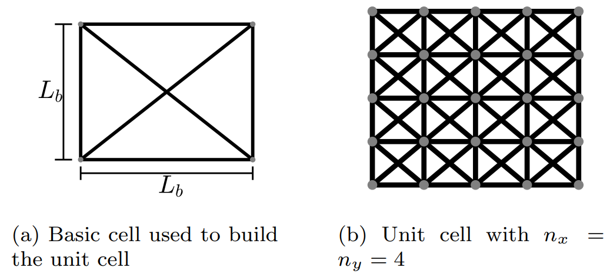
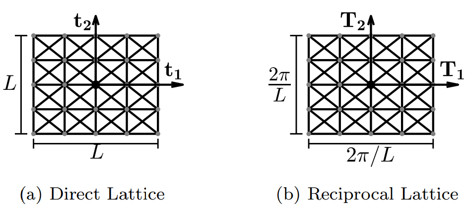
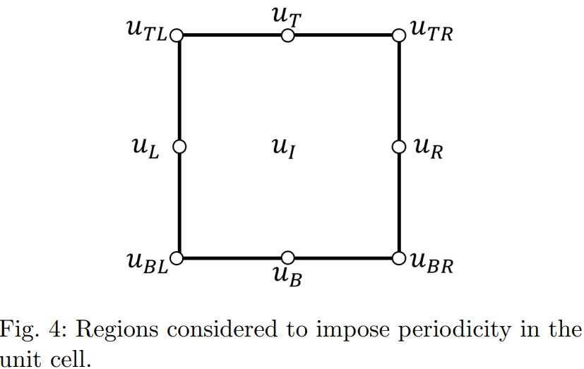
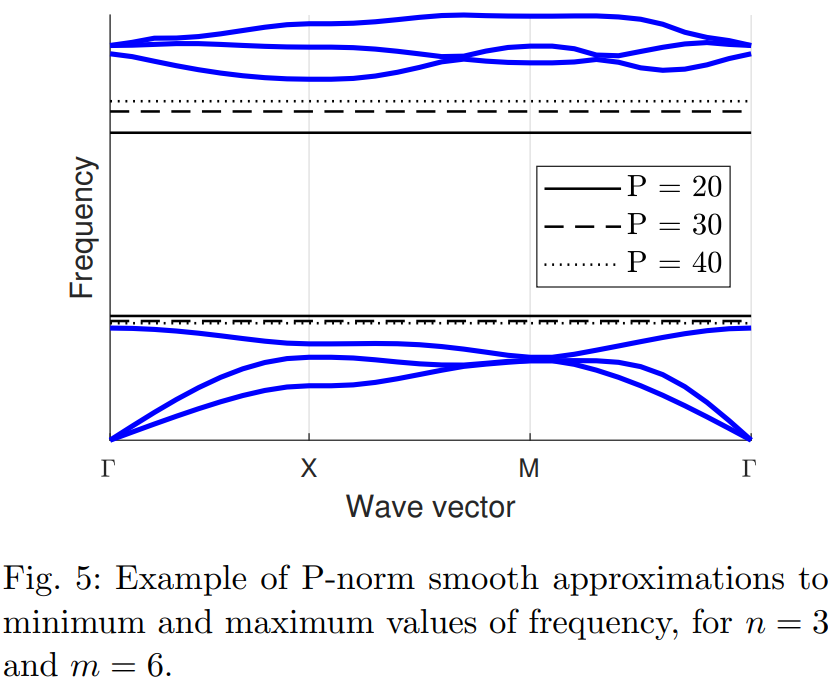

# Phononic structure
## Periodic structure theory

To formulate the optimization problem, it is first necessary to present some basic concepts in periodic structure theory (PST). This is necessary  to impose the proper boundary conditions representing the infinite periodicity of the unit cell. \\
The first step is to describe the unit cell geometry. The unit cell used in this work is built as an arrangement of basic cells, which are comprised of  six linear truss elements and four nodes as shown in  Fig. 1. The unit cell is made of $n_{x}$ and $n_{y}$ basic cells, where $n_{x}$ and $n_{y}$ are the number of cells in the $x$-axis and $y$-axis, respectively. Fig. 1 presents an example of a unit cell with $n_{x}=n_{y}=4$. Thus, the unit cell used in this work is a simple cubic Bravais lattice and an infinite $2D$ geometry is represented by imposing periodic boundary conditions to the unit cell to represent an infinite arrangement  in both the x and y axis. 

Direct lattice vectors, denoted by $\mathbf{t}_{1}$ and $\mathbf{t}_{2}$, are defined at the unit cell as shown in Fig. 2. This figure also describes the unit cell space, with length and width equal to $L$. A reciprocal cubic lattice can then be defined as shown in Fig.\ref{fig:Reciprocal Lattice}  and the reciprocal lattice vectors are denoted as $\mathbf{T}_{1}$ and $\mathbf{T}_{2}$. Vector $\mathbf{T}_{1}$ is perpendicular to $\mathbf{t}_{2}$, with a magnitude equal to $2\pi/L$, whereas $\mathbf{T}_{2}$ is defined as a vector perpendicular to $\mathbf{t}_{1}$ with a magnitude equal to $2\pi/L$. It should be noted that in Fig. 2 the origin of the plane is set at the center of the unit cell.

 The reciprocal  lattice  has both up/down  and left/right reflection symmetries, as well as reflection symmetry at a $45^{\circ}$ plane. The Irreducible Brillouin Zone (IBZ) is thus defined from the independent part of the domain. The symmetry exercise also has the function of reducing the number of design variables to decrease computational cost.

The corners of the triangle defined by the IBZ are denoted as $\Gamma$, $M$ and $X$ and a wave vector $\mathbf{k}$ can be defined as a closed path following the perimeter defined by these corners. This path starts from $\Gamma$, pass through $X$ and $M$ to finally return to $\Gamma$, as shown in Fig. 3. If the unit cell is assumed as periodic in space,  Floquet-Bloch wave theory states  that the periodic displacement in the reciprocal space is described by

$$

\begin{equation}
    \mathbf{u}(\mathbf{X}+\mathbf{r}) = \mathbf{u}(\mathbf{X})e^{i\mathbf{k} \cdot \mathbf{r}},
\end{equation}

$$

where $\mathbf{r}$ is the periodicity of the cell, $\mathbf{u}$ is the displacement, $\mathbf{k}$ is the wave vector and $i$ the imaginary number. The wave vector gives the equation any possible mode of periodicity with respect to periodicity $\mathbf{r}$.
 

## Finite element formulation
The unit cell is modeled by using linear truss finite elements for each strut. Each local matrix is a function of two design variables: area of the cross section  and  material, specified by its Young's modulus and density. Variable $x_{e}^{A}$ controls the effective cross-sectional area of element $e$ and $x_{e}^{M}$ controls the effective material of element $e$. The objective is to distribute two different base materials with properties $E_1$ and $\rho_1$ or $E_2$ and $\rho_2$. The cross-section area is interpolated between two limit values $A_1$ and $A_2$.  %and two different cross sections.
 
 In this problem $x_{e}^{A}$ and $x_{e}^{M}$ are defined as continuous variables in the range $[0,1]$. This is performed by using an interpolation function between the range limits.The form of the interpolation function depends on the physics of the problem. Nevertheless there is no need to use non-linear interpolation functions or to penalize intermediate values (values other than zero or one), since in the band gap phenomenon large contrast between materials is favored. Therefore, a linear interpolation function is implemented here. In this case, the interpolation of a property, $P(x)$, which could be area, Young's modulus or density ($A(x)$, $E(x)$ and $\rho(x)$) is defined as,
$$
\begin{equation}
    P(x) = (P_{2}-P_{1})x + P_{1},
\end{equation}
$$

where $x$ represents the interpolation variable ($x_{e}^{A}$ or $x_{e}^{M}$). If $x$ equals zero, then the property will take the value $P_{1}$, whereas if $x$ is equal to one the property will be equal to $P_{2}$. Therefore, if $x_{e}^{A} = 0$, the element $e$ will be assigned with the section area $A_{1}$, and if the value is $1$ instead, the section area will be $A_{2}$. The same logic applies for the materials: if the design variable $x_{e}^{M} = 0$ the element $e$ is assigned with $E_{1}$ and $\rho_{1}$, and if the value is $1$ the Young's modulus is $E_{2}$ and the density is $\rho_{2}$. In this case, $x_{e}^{M}$, controls both material properties, Young's modulus, and density.

The interpolation given in Eq. (2) is employed to define local stiffness and mass matrices as presented in Eqs. (3) and (4), which assume linear shape functions.

$$
\begin{equation}
\mathbf{K}_{e}(x_{e}^{M},x_{e}^{A}) = \frac{E(x_{e}^{M})A_(x_{e}^{A})}{L}
\begin{pmatrix} 1 & 0 &-1 &0\\ 0 & 0 &0 &0\\-1 & 0 &1 &0\\ 0 & 0 &0 &0\\\end{pmatrix},
\end{equation}

$$

$$
\begin{equation}
\mathbf{M}_{e}(x_{e}^{M},x_{e}^{A}) = \frac{\rho(x_{e}^{M})A_(x_{e}^{A})L}{6}
\begin{pmatrix} 2 & 0 &1 &0\\ 0 & 2 &0 &1\\1 & 0 &2 &0\\ 0 & 1 &0 &2\\\end{pmatrix},
\end{equation}
$$

where $E(x_{e}^{M})$, $\rho(x_{e}^{M})$ and $A(x_{e}^{A})$ are the interpolated values.

### Boundary condition

For 2D problems, the wave vector $\textbf{k}$  can be written as

$$
  \begin{equation}
     \textbf{k} = k sin\theta\hat{I}+kcos\theta \hat{J}
 \end{equation}
 $$
 
 where $k$ is the length and $\theta$ is the angle relative to the horizontal direction. This vector moves around the IBZ perimeter. Thus, using Fig. (1) as reference, periodic Bloch boundary conditions can be imposed according to the following relations,
 

 
 
 $$
 \begin{equation}
\begin{aligned}
&\mathbf{u}_{T}=\mathbf{u}_{B}e^{i L kcos\theta} \\
&\mathbf{u}_{R}=\mathbf{u}_{L}e^{i L ksin\theta} \\
&\mathbf{u}_{BR}=\mathbf{u}_{BL}e^{i L kcos\theta} \\
&\mathbf{u}_{TL}=\mathbf{u}_{BL}e^{i L ksin\theta} \\
&\mathbf{u}_{TR}=\mathbf{u}_{BL}e^{i L k\left( cos\theta +sin\theta \right)}
\end{aligned}
\end{equation}
$$

where vector $\mathbf{u}_{L}$ represents all the nodes in the left line, $\mathbf{u}_{R}$ right line, $\mathbf{u}_{B}$ bottom line and $\mathbf{u}_{T}$ top line. However, those vectors do not consider the corners, which are denoted by $\mathbf{u}_{BL}$, $\mathbf{u}_{BR}$, $\mathbf{u}_{TL}$ and $\mathbf{u}_{TR}$. All the internal nodes are arranged in the vector $\mathbf{u}_{I}$.
 

 

Thus, the number of independent nodes can be reduced with the relation $\mathbf{u}=\mathbf{T}\tilde{\mathbf{u}}$, where $\mathbf{u}$ is the vector of all nodal displacement, $\tilde{\mathbf{u}}$ is the reduced vector and $\mathbf{T}$ is a matrix mapping both vectors. Vectors $\mathbf{u}$ and $\tilde{\mathbf{u}}$ are expressed as,

$$
\begin{gather}
 \mathbf{u}
 =
  \begin{bmatrix}
  \mathbf{u}_{L}\\
  \mathbf{u}_{R}\\
  \mathbf{u}_{B}\\
  \mathbf{u}_{T}\\
  \mathbf{u}_{BL}\\
  \mathbf{u}_{TL}\\
  \mathbf{u}_{BR}\\
  \mathbf{u}_{TR}\\
  \mathbf{u}_{I}
   \end{bmatrix};\:\:\: \tilde{\mathbf{u}}
 =
  \begin{bmatrix}
  \mathbf{u}_{L}\\
  \mathbf{u}_{B}\\
  \mathbf{u}_{BL}\\
  \mathbf{u}_{I}
   \end{bmatrix},

\end{gather}
$$

and matrix $\mathbf{T}$ is given by

$$
\begin{gather}
\mathbf{T}
 =
  \begin{bmatrix}
   \mathbf{I} & 0 &0&0\\
   \mathbf{I}e^{i L k sin\theta} &0&0&0\\
   0&\mathbf{I}&0&0\\
   0&\mathbf{I}e^{i L k cos\theta}&0&0\\
   0&0&\mathbf{I}&0\\
   0&0&\mathbf{I}e^{i L k sin\theta}&0\\
   0&0&\mathbf{I}e^{i L k cos\theta}&0\\
   0&0&\mathbf{I}e^{i L k \left(sin\theta +cos\theta\right)}&0\\
   0&0&0&\mathbf{I}\\
   \end{bmatrix}.
\end{gather}
$$

With these basic definitions, it is possible to write the classical eigenvalue problem to take periodicity into account 

$$
\begin{equation}
    \begin{aligned}
    & \left(\textbf{T}^{T}\textbf{K}\textbf{T}-\omega_{i}^{2}\textbf{T}^{T}\textbf{M}\textbf{T}\right)\textbf{u}_{i}=\textbf{0},\\
    \text{or}
    \\
    & \left(\textbf{K}'(\mathbf{k})-\omega_{i}^{2}\textbf{M}'(\mathbf{k})\right)\textbf{u}_{i}=\textbf{0},
    \end{aligned}
\end{equation}
$$

where $\mathbf{K}$ and $\mathbf{M}$ are the global stiffness and mass matrices, respectivelly, $\lambda_{i}$ corresponds to the $i$-th eigenvalue ($\lambda_{i}=\omega_{i}^{2}$), and $\mathbf{u_{i}}$ the $i$-th mode shape associated with the corresponding wave vector.

The periodic mapping matrix $\mathbf{T}$ introduces the dependence with respect to the wave vector $\mathbf{k}$ in the problem. Thus, if $m$ eigenvalues are evaluated as a function of the wave vector and arranged along the path $\Gamma - M - X - \Gamma$, it is possible to plot a band diagram. This diagram characterizes the dynamic response of the microstructure as a function of $\mathbf{k}$ and shows what wavelengths can be transmitted along the unit cell. 

## Optimization problem

### Optimization

The optimization problem consists of finding the microstructure that maximizes the band gap defined as the distance between two adjacent bands $n$ and $n+1$. Figure 5 shows a typical band diagram with six bands (blue lines), where a gap between the third and fourth bands can be observed. The band gap width, which will be maximized, is defined as the distance between the minimum value of $\bm{\omega}_{n+1}(\mathbf{k})$, and the maximum value of $\bm{\omega}_{n}(\mathbf{k})$ for $\mathbf{k} \in [\Gamma,X,M,\Gamma]$. As previously defined, design variables $\textbf{x}$ include the area $x_{e}^{A}$ and material $x_{e}^{M}$ of each element $e$ and the wave vector $\textbf{k}$ is evaluated at the perimeter of the IBZ. The formulation reads

$$
\begin{equation}
\max_{\textbf{x}} \quad  \min \bm{\omega}_{n+1}(\textbf{x},\textbf{k})- \max \bm{\omega}_{n}(\textbf{x},\textbf{k}) 
\end{equation}
$$ 

$$
\begin{equation}
\text{subject to} \quad (\textbf{K}'(\mathbf{k})-\omega^{2} \textbf{M}'(\mathbf{k}))\textbf{u} = \textbf{0}   
\end{equation}
$$ 

$$
\begin{equation}

 0\leq\textbf{x}_{i}\leq 1 
\end{equation}
$$ 

An issue when directly addressing eigenvalues in optimization is the non-differentiability associated with repeated eigenvalues. Other problem when targeting specific eigenvalues is the mode switch that may occur during optimization. Aiming to solve this problem, we propose the use of P-norms smooth approximations for both $\max \bm{\omega}_n$ and $\min \bm{\omega}_{n+1}$ in the form
$$
\begin{equation}
    \max  \bm{\omega}_{n}(\mathbf{k})   \approx  ||\bm{\omega}_{n}||_{P} = \left( \sum_{j=1}^{n} \sum_{i=1}^{IBZ} \omega_{ij}^{P}\right)^{1/P},
\end{equation}
$$
and
$$
\begin{equation}
    \min \bm{\omega}_{n+1}(\mathbf{k})  \approx ||\bm{\omega}_{n+1}||_{-P} = \left(  \sum_{j=n+1}^{m} \sum_{i=1}^{IBZ} \omega_{ij}^{-P}\right)^{-1/P}.
\end{equation}

$$
In both expressions, the sum $i=1$ to $IBZ$ is the discretization of the wave vector $\mathbf{k}$ and index $j$ represents the band number. 

In Eq. (13) the sum goes from $i=1$ to $n$, representing the maximum value for bands $1$ to $n$, that is, all the eigenvalues in this range are taken into account to evaluate the norm. Eq. (14) considers all the eigenvalues from $n+1$ to $m$, representing the minimum value for bands $n+1$ to $m$.
Both approximations combine a finite set of eigenvalues, thus hindering mode switch inside each set. Also, as the objective is to increase the distance between both sets, there is little possibility of mode switching between both sets, as discussed in the results section.

Figure 5 shows a band diagram containing a band gap. Eqs. (13) and (14) are evaluated considering $n=3$ and $m=6$ for different values of $P$. It can be seen that as $P$ increases, Eq. (14) converges to the true minimum and Eq. (13) to the true maximum, even though there are intersections (repeated values) in the diagram. 